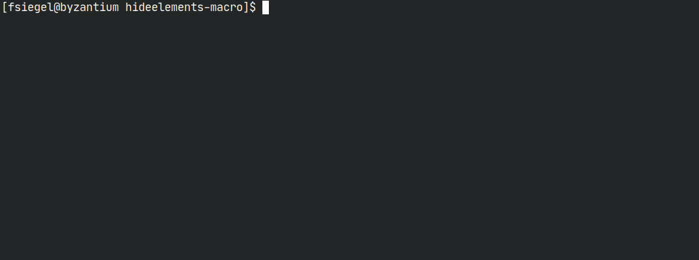
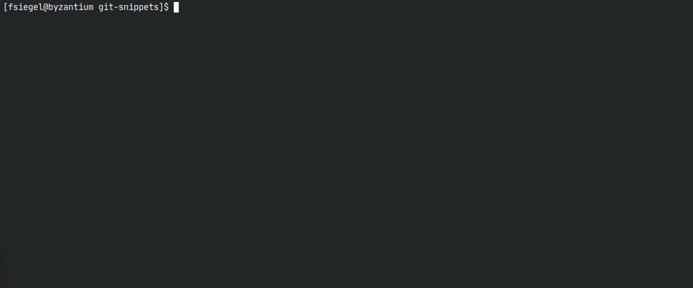

<!-- markdownlint-configure-file
{
  "no-bare-urls": false,
  "no-trailing-punctuation": false,
  "line-length": false
}
-->

# pluploader

 



A advanced command-line plugin uploader/installer/manager for atlassian
server and cloud instances (Confluence/Jira) written in python(3).

## Installation

Regulary tested on Linux (Arch Linux), MacOS and Windows 10.

### pip (recommended)

```bash
pip3 install pluploader
```

### brew (MacOS)

```bash
brew tap craftamap/tap && brew install pluploader
```

### Docker

If you do not want to install python3 or pip, you can also pull the latest
docker image from dockerhub or github:

```bash
docker pull craftamap/pluploader:latest
# OR
docker pull ghcr.io/craftamap/pluploader/pluploader:v0.8.0
```

pluploader can then be run by executing

```bash
docker run -v "$(pwd)":/workdir -it craftamap/pluploader:v0.8.0
```

## Usage

For a in-depth explanation, see `pluploader --help`

> ℹ This documentation describes the master branch, and not (necessarily) the latest release.

### Global Options

You can specify various global options:

- `--base-url <base-url>`, default: `http://localhost:8090`  
  For Confluence Cloud Instances, make sure to append the path, `/wiki`, to your base url.
- `--user <username>`, default: `admin`
- `--password <password>`, default: `admin`  
  It is recommended to use Access Tokens instead of your password.
  Newer versions of the server / datacenter products support creating Access Tokens
  called Personal Access Tokens -
  [Read more about them here](https://confluence.atlassian.com/enterprise/using-personal-access-tokens-1026032365.html).  
  For cloud instances, it is required to use Access Tokens. Those are called
  [API Tokens and can be created here](https://id.atlassian.com/manage-profile/security/api-tokens).
  If you do not want to put your password or access token in the command line
  plaintext, you can also use...
- `--ask-for-password`

All Global Options can be overwritten by using a configuration file or enviroment variables.
See more in [Configuration](#Configuration) and [Environment variables](#Environment Variables)

### Configuration

If you don't want to write the username or password (or any other global
parameter) each time, you can use a filed called `.pluprc`, either placed in
your current maven project or/and in your home directory. A example looks like
this:

```bash
base_url: https://example.com:8090
user: admin
password: admin
```

### Environment variables

You can also specify username, password and base url by using `PLUP_USER`,
`PLUP_PASSWORD` and `PLUP_BASEURL`.

### Uploading plugins

If you are in a maven project, the basic usage is fairly simple. Just type:

```bash
pluploader --user admin --password admin
```

The pluploader then uploads and enables the current artifact specified in the
pom.xml

If you are not in a maven directory currently, but you want to upload a specific
file, you can also use the `-f plugin.jar` flag.

If you want to confirm your upload, you can also use the `-i` /
`--interactive` flag.

It is recommended to use the pluploader with maven. The usage looks like:

```bash
atlas-mvn clean package && pluploader
```

#### Installing apps from the marketplace


pluploader supports downloading apps from the atlassian marketplace to your local
machine and installing them afterwards. You need to supply either `--mpac-key`,
which is the normal addon-key, or `--mpac-id` (experimental), which is the
numeric id of an marketplace id (72307 https://marketplace.atlassian.com/apps/72307)

```bash
pluploader --mpac-key com.atlassian.confluence.extra.team-calendars
```

**NOTE**:
If you specify one of the global options, you need to add the `install`-command:

```bash
pluploader --base-url https://your-confluence.com:8090 install
```

You can work around this by using the configuration file or by using environment variables.

### Installing a connect descriptor to a cloud instance.




pluploader also supports installing atlassian-connect plugins to cloud instances
by enabling cloud support with `--cloud` and providing the descriptor url with `--plugin-uri`.

```bash
pluploader install --cloud --plugin-uri https://your.ngrok.here
```

### Managing plugins


pluploader can also replace the usage of the universal plugin manager completely
by using the subcommands `list`, `info`, `enable`, `disable`, and `uninstall`
(`enable` and `disable` are not supported in the atlassian cloud).

To get a list of all installed plugins of the configured instance, just type:

```bash
pluploader list
```

A green checkmark indicates that the plugin is enabled, while a exclamation mark
indicates that the plugin is disabled.

In order to retrieve more information about a specific plugin, you can use the
command `info`.

```bash
pluploader info com.example.plugin.key
```

The plugin key can be omitted in a maven directory, if the parameter
`atlassian.plugin.key` is set in plaintext.

The commands `enable`, `disable` or `uninstall` follow the same syntax.

### Safe Mode

pluploader also supports disabling or enabling all apps using Safe Mode (does not work in cloud).

To retrieve the status if safe-mode is enabled at the moment, use

```bash
pluploader safe-mode status
```

You can enable and disable safe mode by using

```bash
pluploader safe-mode enable
```

And

```bash
pluploader safe-mode disable
# OR
pluploader safe-mode disable --keep-state
```

### Licenses

You can also use the pluploader to get and set licenses for your plugins.

To get the current license information:

```bash
pluploader license info com.example.plugin.key
```

To set a license, use the `update` functionality.

```bash
pluploader license update com.example.plugin.key --license "AAA..."
```

> ℹ Pro tip: Use `xargs` to read a license from a file by using
>
> ```bash
> cat license.txt | xargs pluploader license update --license
> ```

You can also apply [timebomb licenses](https://developer.atlassian.com/platform/marketplace/timebomb-licenses-for-testing-server-apps/)

by using

```bash
pluploader license timebomb com.example.plugin.key --timebomb threehours
```

You can choose between 3 hours (threehours), 60 seconds (sixtyseconds) and
10 seconds (tenseconds)

To remove an applied license, you can use:

```bash
pluploader license delete com.example.plugin.key
```

#### Access Tokens (Cloud Development Licenses)

You can also use pluploader to list, get, update/set and delete access tokens of apps.

```bash
pluploader license access-token list
pluploader license access-token info com.example.plugin.key
pluploader license access-token update com.example.plugin.key --token "token"
pluploader license access-token delete com.example.plugin.key
```

### API

You can interact with the HTTP/REST-API of your configured instance by using
`pluploader api ENDPOINT [BODY]`. The arguments work a bit like the
well-known tool `curl`. You can use `-X METHOD` to choose the HTTP method and
`-H "HEADER-NAME: HEADER-VALUE"` to add a HTTP header.

```bash
pluploader api -X POST -H "content-type: application/json" rest/api/content/ '{ "type":"page", "title":"My Test Page", "space":{"key":"TEST"}, "body":{ "storage": { "value":"<p>This is a new page</p>", "representation":"storage" } } }'
```

### RPC

`pluploader rpc` allows interaction with the (deprecated, but  still
functional) confluence rpc api by providing the method name and it's
required arguments. You do not need to care about the rpc-authentication,
as this command takes care of it. Therefore, you can also obmit the first
parameter (String token) required for many commands.


```bash
pluploader rpc addUser '{"name":"charlie", "fullname": "charlie", "email":"charlie@charlie"}' charlie
```

### Scheduled Jobs (Confluence - Experimental)

> ℹ This feature is currently experimental and only works in specific version of
> Confluence (tested on Confluence 7.5).

Pluploader can also be used to retrieve information about confluence jobs and
execute them.

You can grab a list of all jobs by running

```bash
pluploader job list
```

Available options are:

- `--hide-default` - Hides confluence internal jobs
- `--print-all-infos` - print more informations

You can also run jobs by running

```bash
pluploader job run
```

Get more information about a job by running

```bash
pluploader job info
```

And disable or enable jobs by running

```bash
pluploader job enable
# AND
pluploader job disable
```

A job can be specified by either using `--id <job id>` or by using
`--idx <job index in list>`. If no job is specified, you will be asked
interactively.


## Development

pluploader uses [poetry](https://python-poetry.org/) as it's package manager. As a command line argument parser, [Typer](https://typer.tiangolo.com/) is used.

## FAQ

### Why would I use the pluploader over X?

Of course, you can use whatever tool you want to.

### Why would I use the pluploader over the UPM?

It's a faster workflow.

### Why would I use the pluploader over the Atlas-CLI?

atlas-cli is awesome, but sadly it's deprecated. Also since you can use your own
maven command with pluploader, you therefore can skip tests, make a mvn clean,
and many more.

In general, pluploader is just a bit more flexiable.

### Why would I use the pluploader over QuickReload?

QuickReload is cool, but some of us prefer to use docker instances or atlas-standalone
rather than atlas-run.
